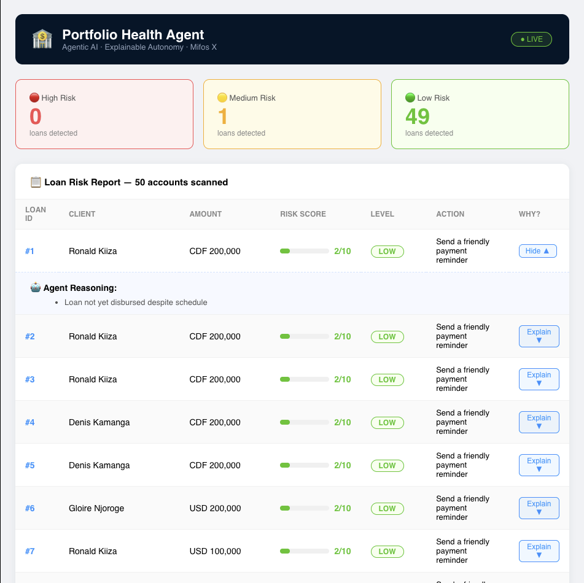
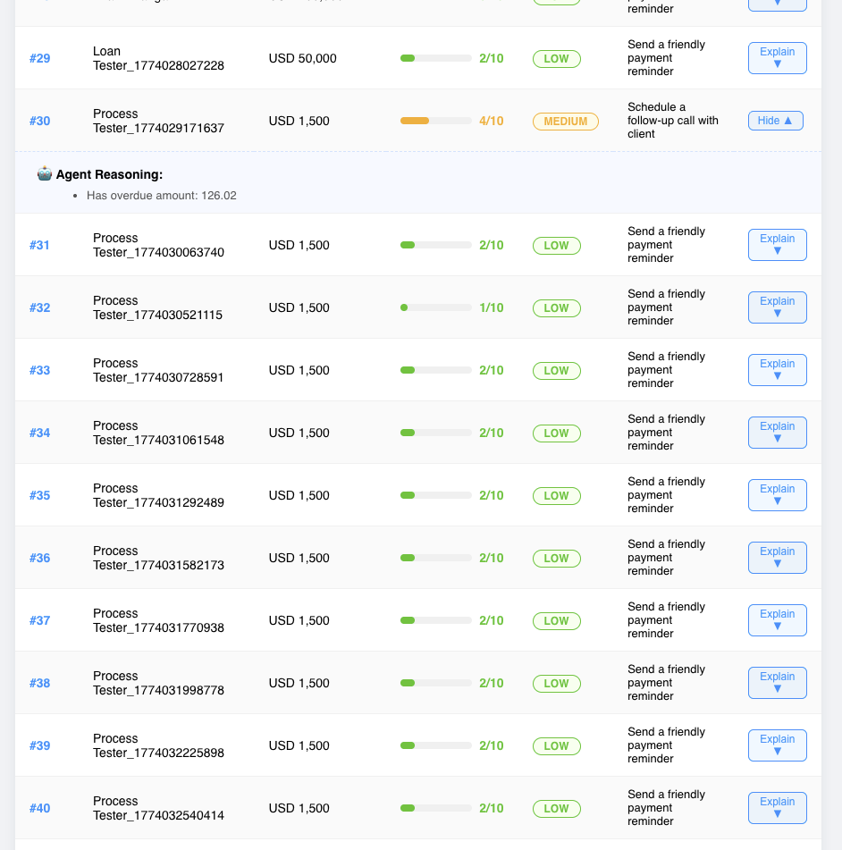

# 🏦 Portfolio Health Agent

> Agentic AI for Proactive Portfolio Management with Explainable Autonomy
> Built as a working prototype for **DMP 2026** — Mifos Initiative Issue [#2](https://github.com/openMF/mifos-x-ai-agentic-framework/issues/2)

---

## 📸 Demo

### Dashboard Overview


### Explainable AI — Agent Reasoning


---

## 🎯 What This Does

This prototype is the foundation of a full **Portfolio Health Agent** that:

- 🔗 Connects to **Mifos X API** and fetches live loan accounts
- 📊 Scores each loan on a **risk scale of 0–10**
- 🤖 Recommends actions automatically:
  - 🟢 Low risk → Send payment reminder
  - 🟡 Medium risk → Schedule follow-up call
  - 🔴 High risk → Escalate to loan officer
- 💬 **Explains every decision** in plain English (Explainable AI)
- 🖥️ Live React dashboard for loan officers to review agent decisions

---

## 🛠️ Tech Stack

| Layer | Technology |
|---|---|
| AI Agent (planned) | Python + LangChain + Ollama |
| Backend API | FastAPI (Python) |
| Frontend | React.js |
| Data Source | Mifos X REST API |
| Explainability | Rule-based reasoning engine |

---

## 🚀 Run Locally

### 1. Clone the repo
```bash
git clone https://github.com//portfolio-health-agent
cd portfolio-health-agent
```

### 2. Start the Backend
```bash
python -m venv venv
source venv/bin/activate        


pip install -r requirements.txt
uvicorn api:app --reload
```

Backend runs at: `http://localhost:8000`
API docs at: `http://localhost:8000/docs`

### 3. Start the Frontend
```bash
cd portfolio-dashboard
npm install
npm start
```

Frontend runs at: `http://localhost:3000`

---

## 📁 Project Structure